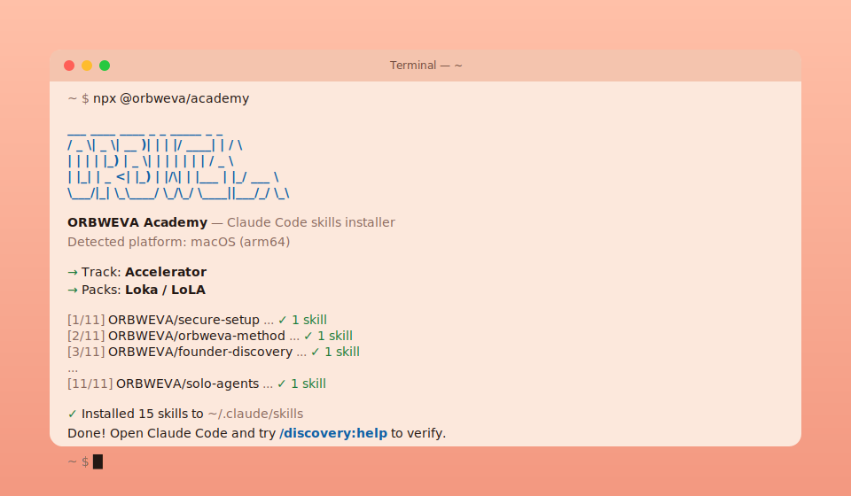

<div align="center">

# @orbweva/academy

[English](README.md) · **日本語** · [한국어](README.ko-KR.md)



ファウンダーに必要なORBWEVA Claude Codeスキルを、1つのコマンドでインストール。

```
npx @orbweva/academy@latest
```

**macOS、Windows、Linux**で動作。Node 18+、ランタイム依存ゼロ。

[](LICENSE)
[](https://orbweva.com/ja/accelerator/skills)

[なぜ存在するのか](#なぜ存在するのか) · [クイックスタート](#クイックスタート) · [トラック](#トラック) · [スペシャライゼーションパック](#スペシャライゼーションパック) · [関連ドキュメント](#関連ドキュメント)

</div>

---

## なぜ存在するのか

ORBWEVAの生徒が最初にやることは、22個のスラッシュコマンドを順番に入力することでした。`/plugin marketplace add …` の後に `/plugin install …` を11回。順番を間違えると `Unknown skill: discovery — Create a new one?` が表示され、反射的にEnterを押すと偽のスキルが作成され、エラーメッセージも出ません。Windowsでは、管理者権限の `winget` と非管理者権限の `scoop` のために2つのPowerShellウィンドウが必要で、`EBADENGINE` 警告は無害だが「'gh' が認識されない」はPATHが古いだけ、と気づくまで半分のインストールが失敗し続けます。

誰も望まない通過儀礼でした。だからこれを作りました。

**このツールができること** — 22個の `/plugin …` コマンドを1つの `npx` 呼び出しに置き換えます。公開されている11個のORBWEVAスキルリポジトリをシャロークローンし、`skills/<name>/` ディレクトリを `~/.claude/skills/` にコピー、その後まだ必要なプラットフォーム固有のCLIツールとMCPサーバーコマンドを表示します。ランタイム依存ゼロ。Node 18+と `git` のみが前提条件です。

## 対象ユーザー

- **ORBWEVA Acceleratorの受講生** — 12週間のコホートプログラム
- **ファウンダートラックのパートナー** — クライアントに軽量なファウンダーベースを再販する代理店など
- **メンタリングクライアント** — 1:1のオペレーターサポートを受けている既存ビジネス
- **セルフペース学習者** — Courseトラック
- **スペシャリスト** — トラックに垂直方向のスキルを重ねる人（Lokaエコシステム、マーケティング代理店、Web+ビデオスタジオ）

どれにも当てはまらないがスキルは欲しい場合は、`--track full` を実行してください。

## クイックスタート

```bash
# メニューからトラックを選択し、いくつかのプロンプトに答える
npx @orbweva/academy@latest

# 特定のトラックに直接行き、オプションスキルごとにプロンプト
npx @orbweva/academy@latest --track accelerator

# 完全に非対話モード（全デフォルト、全オプションスキル、グローバル）
npx @orbweva/academy@latest --track accelerator --yes --global

# トラックの上にスペシャライゼーションを重ねる
npx @orbweva/academy@latest --track accelerator --pack loka
npx @orbweva/academy@latest --track accelerator --pack marketing --pack web-video

# パートナー提供型の軽量ファウンダーベース（Acceleratorのオーバーヘッドなし）
npx @orbweva/academy@latest --track founder
```

## トラック

1つのベースプログラムを選択。トラックごとの詳細は [docs/TRACKS.md](docs/TRACKS.md) を参照。

| トラック | 対象 | スキル数 |
|---|---|---|
| `accelerator` | 12週間コホート — ゼロから一へのファウンダー | 15 |
| `course` | セルフペースのファウンダー基礎 | 9 |
| `mentoring` | 既存ビジネス向け1:1オペレーターサポート | 13 |
| `founder` | パートナー提供型プログラムの軽量ベース（代理店、リセラー） | 10 |
| `full` | すべて — トレードオフなし | 15 |

## スペシャライゼーションパック

どのトラックにも重ねて使用可能。[docs/PACKS.md](docs/PACKS.md) 参照。

| パック | 対象 | ステータス |
|---|---|---|
| `loka` | Loka living-textbook + LoLAアバタープラットフォーム上のビジネス | 計画中 |
| `marketing` | 1人（または小チーム）のマーケティング代理店 | 計画中 |
| `web-video` | Webデザイン + ビデオ編集スタジオ | 計画中 |

> パックリポジトリは `manifest.json` でステージングされていますが、まだ公開されていません。リポジトリが公開されるまで、インストーラーは計画中のパックを優雅にスキップします。

## インストールされる内容

インストーラーはトラック + 追加したパックからスキルセットを構成し、関連する公開ORBWEVAリポジトリをClaude Codeのスキルフォルダにクローンします。

**すべてのスキルとコマンドのフェーズ別カタログ** — [ORBWEVA Accelerator Skills Reference](https://orbweva.com/ja/accelerator/skills) を参照してください。これが正式な情報源です。ここでは重複させません。

## インストールの確認

インストーラーが完了したら、Claude Codeを開いて実行:

```
/discovery:help
```

カスタマーディスカバリーのコマンドメニューが表示されるはずです。`Unknown skill` と表示される場合は [docs/TROUBLESHOOTING.md](docs/TROUBLESHOOTING.md) を参照。

## 更新の維持

ワンライナーを再実行:

```bash
npx @orbweva/academy@latest
```

各リポジトリを再クローンし、既存のスキルフォルダを上書きします。エアギャップまたはnpmなしの環境については [docs/manual-update.md](docs/manual-update.md) を参照。

## すべてのフラグ

| フラグ | 意味 |
|---|---|
| `-t, --track <name>` | トラック選択: `accelerator`, `course`, `mentoring`, `founder`, `full` |
| `-p, --pack <name>` | スペシャライゼーションパックを追加（繰り返し可能） |
| `-g, --global` | `~/.claude/skills/` にインストール |
| `-l, --local` | `./.claude/skills/` にインストール |
| `-y, --yes` | 全デフォルトを受け入れ、選択したもの全てをインストール、プロンプトなし |
| `--skills-only` | インストール後のCLI/MCPガイダンスをスキップ |
| `--dry-run` | 予定を表示、ディスクには触れない |
| `-h, --help` | ヘルプを表示 |

## 関連ドキュメント

**このリポジトリ内:**
- [docs/USER-GUIDE.md](docs/USER-GUIDE.md) — 全フラグの組み合わせを含む詳細ウォークスルー
- [docs/TRACKS.md](docs/TRACKS.md) — トラックごとの詳細
- [docs/PACKS.md](docs/PACKS.md) — スペシャライゼーションパックの構造 + 追加方法
- [docs/CLI-TOOLS.md](docs/CLI-TOOLS.md) — OS別CLIインストールリファレンス（Windowsの落とし穴を含む）
- [docs/MCP-SERVERS.md](docs/MCP-SERVERS.md) — トラック別MCPサーバー設定
- [docs/manual-update.md](docs/manual-update.md) — npmなし環境向けフォールバックインストール
- [docs/TROUBLESHOOTING.md](docs/TROUBLESHOOTING.md) — インストーラー固有の問題

**ORBWEVAエコシステム内:**
- [ORBWEVA Accelerator Skills Reference](https://orbweva.com/ja/accelerator/skills) — スキル + コマンドのフェーズ別正式カタログ
- [Accelerator Curriculum Template](https://github.com/ORBWEVA/accelerator-template) — 12週間プログラムガイド
- [プログラムトラブルシューティングガイド](https://github.com/ORBWEVA/accelerator-template/blob/main/docs/TROUBLESHOOTING.md) — インストーラー以外の問題（セッション中のスキル失敗、APIキーなど）
- [卒業基準](https://github.com/ORBWEVA/accelerator-template/blob/main/docs/GRADUATION_CRITERIA.md) — Acceleratorの「完了」の定義

## コントリビュート

トラック、パック、スキルリポジトリの追加は [CONTRIBUTING.md](CONTRIBUTING.md) 参照。ほとんどの変更は `manifest.json` の1行編集です。

## ライセンス

ORBWEVAエコシステムに合わせてデュアルライセンス:

- **ソースコード** (`bin/`, `src/`, `manifest.json`) — [MIT](LICENSE)
- **ドキュメントとプロース** (READMEファイル、`docs/`、`CHANGELOG` など) — [CC BY-NC-SA 4.0](LICENSE-DOCS)

インストールされるスキルは個別のORBWEVAリポジトリにあり、それぞれ独自のライセンス（通常CC BY-NC-SA 4.0）に従います。このインストーラーは再ライセンスしません。

© 2026 ORBWEVA. 商用利用のお問い合わせ: legal@orbweva.com.
